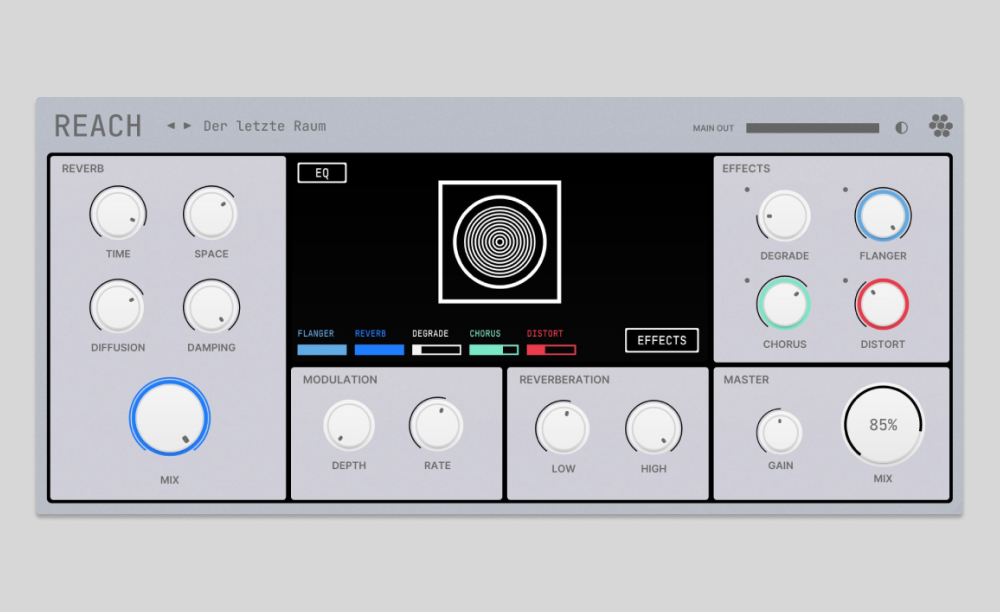

# REACH

> Extraterrestrial Reverb for Electronic Music

[-> Product Page](https://sinuslabs.io/product/reach/)

### Downloads

* [Windows](https://github.com/Sinuslabs/Reach/releases/latest/download/reach-installer.exe) 
* [MacOS](https://github.com/Sinuslabs/Reach/releases/latest/download/reach-installer.pkg)
* [Linux](https://github.com/Sinuslabs/Reach/releases/latest/download/reach-installer.sh)

### Features

REACH is modern creative Reverb that is made for synthetic sound sources. There are four effects included to transform the Signal. It features modular routing, pre and post filters and over 40 Presets.

* Made for synthetic sound sources
* 4 effects included to shape the reverb
* pre / post filters
* modular effect routing
* dark / light theme
* free scaling
* low cpu usage
* 50 presets

### Sound Demos

https://soundcloud.com/sinuslabs/sets/reach-audio-examples

### Contribution

If you are interested in contributing to this Project please contact the owner of this repository directly via email: hello@sinuslabs.io

