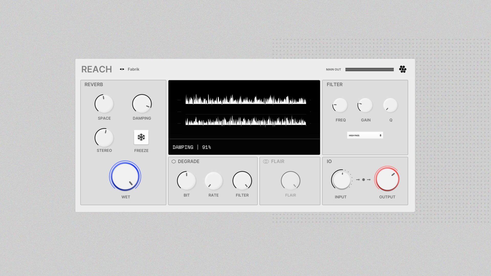
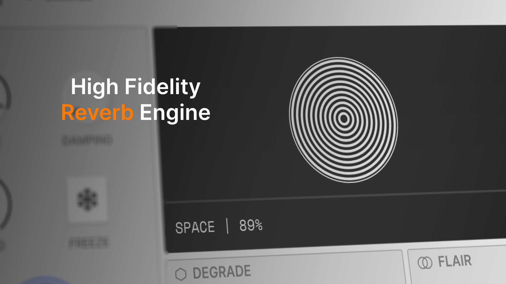
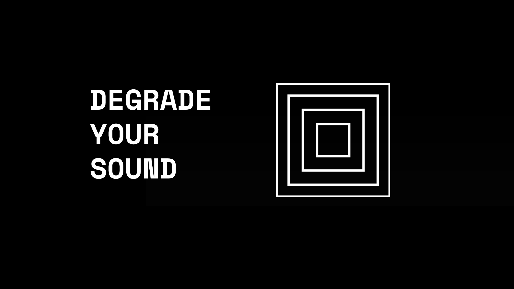
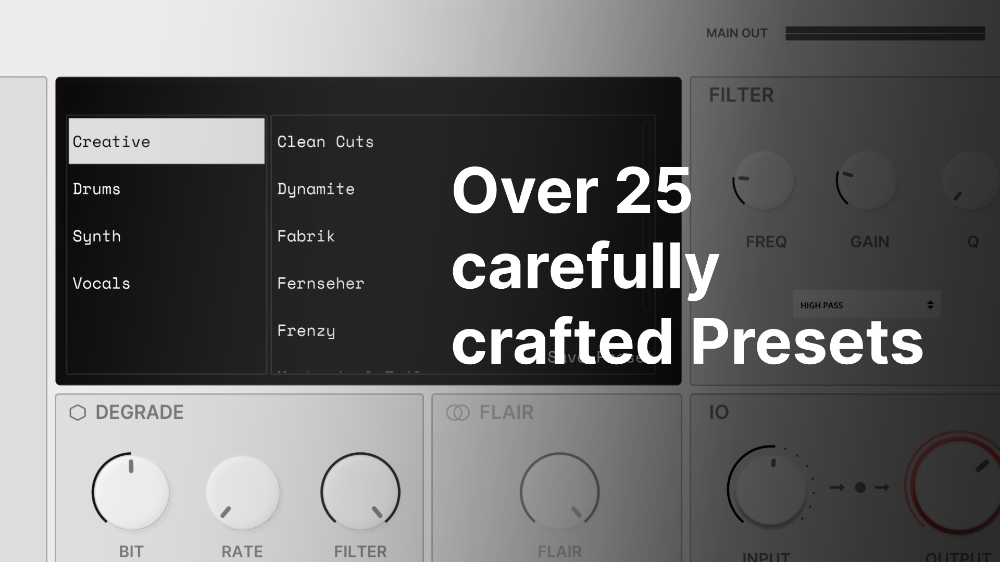


  

 


Extraterrestrial Reverb with a unique Sound


  

### Installation

To install Reach simply download the [Binary](https://github.com/Sinuslabs/Reach/releases) from the Github Releases Page. There are installer for Windows, Mac and Linux available.

To obtain a valid License for this tool visit [sinuslabs.io](https://sinuslabs.io/reach).

### Features









To learn more about this Plugin visit the Product Page on [sinuslabs.io](http://sinuslabs.io)

### Contribution

If you are interested in contributing to this Project please contact the owner of this repository directly via email: hello@sinuslabs.io

